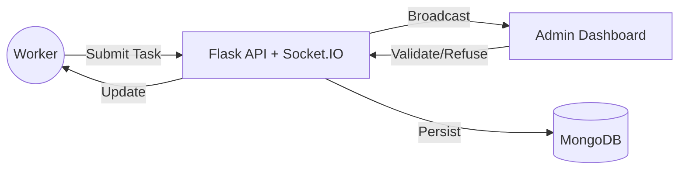

# Enterprise Task Streaming & Real-Time Analytics


## 🚀 Overview

This is an enterprise-grade **Real-Time Task Streamer** designed for high-velocity environments where administrators need to validate suggestions from multiple workers in real-time.

### 🌟 Key Features

- **Real-Time Orchestration**: Powered by WebSockets (Socket.IO) for sub-millisecond latency.
- **Dynamic Grid Engine**: An intelligent dashboard that automatically rescales task cards based on volume to maintain visibility without scrolling.
- **Validation Workflow**: Integrated ✅ Validate and ❌ Refuse actions with instant feedback loops to workers.
- **Enterprise Security**: Role-Based Access Control (RBAC) with JWT stateless authentication.
- **Glassmorphism UI**: A high-end, futuristic interface designed for modern security consoles and command centers.

---

## 🏗️ System Architecture



## 🛠️ Quick Start

### 1️⃣ Requirements
- Docker & Docker Compose

### 2️⃣ Launch Environment
```bash
docker-compose up --build
```

### 3️⃣ Access
- **Application:** [http://localhost:3000](http://localhost:3000)
- **API Health:** [http://localhost:5000](http://localhost:5000)

---

## 📖 User Guides

### For Administrators
1. Register an account with the **Admin** role.
2. Launch a new **Scan** session from the dashboard.
3. Observe tasks arriving in real-time.
4. Use the validation buttons to approve or reject suggestions.

### For Workers
1. Register as a **Worker**.
2. Navigate to a scan link (e.g., `/worker/scan/<id>`).
3. Submit observations or task suggestions.
4. Watch your submission status update live as the admin interacts with it.

---

## 🔒 Security Best Practices
- **HMAC-signed JWTs** for all communications.
- **WebSocket Sandboxing**: Users only receive events for rooms they have joined.
- **Password Hashing**: Protected by `PBKDF2` with salt via Werkzeug.

